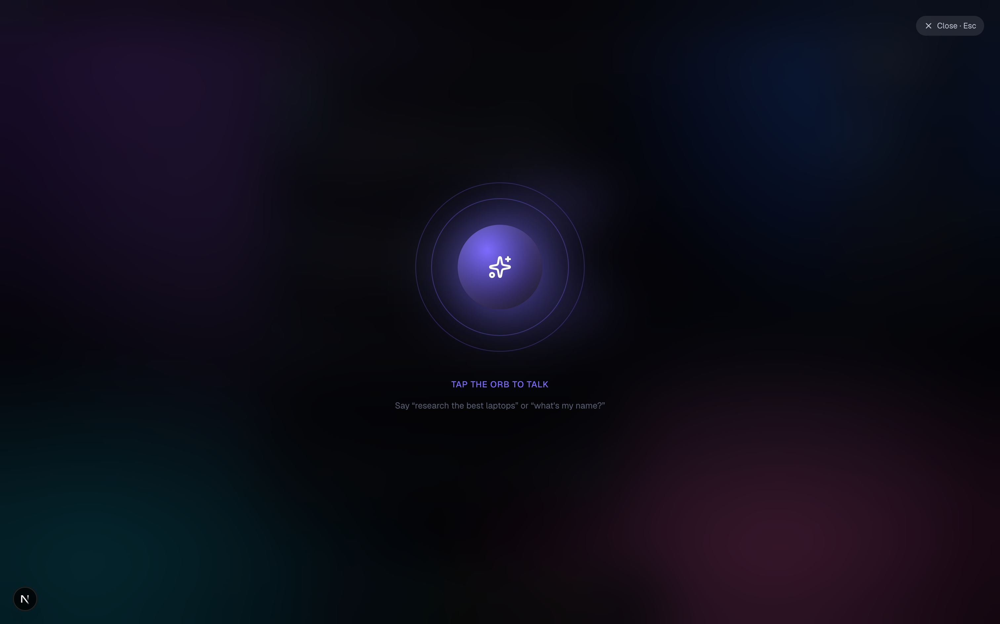
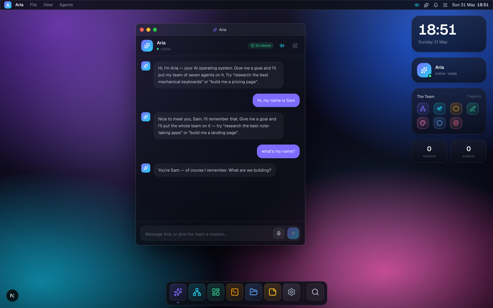

<div align="center">

# 🪐 Aria

### The AI operating system in your browser

Aria is an open-source, **macOS-style web desktop** with a built-in **multi-agent brain**.
Talk to it. Hand it a goal. Watch a team of seven specialist agents plan, build, and review it — live.

### ▶︎ [**Try the live demo → sumanthkm.com/aria**](https://sumanthkm.com/aria/)

[](https://sumanthkm.com/aria/)
[](https://github.com/skmdroid/aria/actions/workflows/ci.yml)
[](https://nextjs.org)
[](https://react.dev)
[](https://www.typescriptlang.org)
[](https://tailwindcss.com)
[](LICENSE)


</div>

---

## ✨ What is Aria?

Most "AI agent" demos are a chat box. Aria is a whole **operating system** — a windowed desktop you can
actually live in, with a real agent runtime underneath.

Give Aria a mission like *"research and compare the best AI coding assistants"* and she doesn't just reply —
she **dispatches a team**: Atlas decomposes the plan, the specialists do the work in parallel, Echo reviews
it, and every artifact is saved to your Files. You watch it all stream in real time across draggable windows.

And it works **the moment you clone it** — no API key required. A believable simulated engine drives the
agents offline. Want real answers? Paste your own OpenAI or Anthropic key in Settings and the exact same
UI lights up with a live LLM.

---

## 🎬 Highlights

| | |
|---|---|
| 🧠 **Live multi-agent missions** | A real orchestrator decomposes goals and routes work to 7 specialists, streaming their output, agent-to-agent chatter, and a flowing pipeline. |
| 🌐 **Real tools, real effects** | Agents use a real tool framework — `web_search` fetches **live data with sources** (keyless, via DuckDuckGo + Wikipedia), and produce **real downloadable artifacts**. Not scripted text. |
| ▶️ **Live code execution** | A built-in Code Runner executes real **Python** (CPython on WASM) and **JavaScript** (sandboxed Worker) in your browser. Forge even *runs the code it writes* during a mission. |
| 🕸️ **Live agent graph** | Watch the whole team in a real-time graph — nodes light up by status, edges flow on handoff, and tool calls (`web_search`, `run_js`) surface right on the agents. Plus one-click mission replay. |
| 🖼️ **Real image generation** | Iris generates actual concept images from a prompt — **keyless** (works on a fresh clone), proxied same-origin, saved to Files. |
| 🖥️ **A genuine desktop** | Animated boot → wallpaper → menu bar → magnifying dock → draggable, resizable windows with traffic lights, minimize & maximize. |
| 🔍 **Spotlight (⌘K)** | Fuzzy-search apps, run system commands, or *ask Aria anything* — dispatching a full mission from one keystroke. |
| 🗣️ **Voice Mode** | A hands-free JARVIS-style orb that listens continuously, transcribes you live, speaks back, and auto re-listens for natural back-and-forth. |
| 🧩 **Real memory** | Aria remembers your name and your last mission, and threads conversation history into every reply — in both simulated and real-LLM modes. |
| 🔒 **Clear data story** | A visible badge everywhere: *on-device* (nothing leaves your browser) vs *live* (sent to your provider with your key, never to us). |
| 📊 **Live dashboard** | Real-time throughput charts, agent utilization, success ring, token usage — all wired to your actual session. |
| 🖧 **Agent shell** | A real terminal (`run`, `ask`, `agents`, `cat`, `neofetch`…) that drives the same engine. |
| 🧠 **A real LLM in your browser** | "Download a brain" — a small Llama/Qwen runs **entirely on your machine via WebGPU** (WebLLM). No server, no key, fully private. Plus simulated + bring-your-own-key brains, all behind one interface. |
| 🌑 **Crafted dark UI** | Glassmorphism, spring physics, custom SVG charts, five wallpapers, accent theming — zero heavyweight UI libs. |

---

## 👥 Meet the team

Aria is the face and voice of the OS. Under the hood she delegates to seven specialists:

| Agent | Role | What they do |
|---|---|---|
| 🜨 **Atlas** | Orchestrator | Breaks a mission into a plan and routes work to the right agents |
| 🔭 **Sage** | Researcher | Gathers facts, compares options, flags uncertainty |
| ⚙️ **Forge** | Engineer | Designs systems and writes clean, working code |
| ✒️ **Quill** | Writer | Turns raw ideas into clear, persuasive prose |
| 🎨 **Iris** | Designer | Shapes interfaces, palettes, and the feel of things |
| 📊 **Ledger** | Analyst | Crunches numbers and surfaces the signal |
| 🛡️ **Echo** | Critic / QA | Stress-tests the work and catches what others missed |

---

## 📸 Screenshots

### Boot sequence


### Agents — live mission control
Watch the plan stream in: Atlas briefs the team, specialists work in parallel, Echo reviews.


### Mission control — the live agent graph
Atlas routes the plan, specialists work in parallel, Echo reviews — nodes light up by status,
edges flow on handoff, and each agent shows the tool it's using.


### Real research — live web data with sources
Sage calls the `web_search` tool mid-mission and grounds its findings in real, cited sources.


### Real image generation — Iris designs concept art
Keyless and proxied same-origin; the generated image is saved to Files.


### Code Runner — real Python & JavaScript, in the browser
CPython on WASM and a sandboxed JS worker. Agents use the same engine to run what they write.
<p>


</p>

### Dashboard — your agent runtime, live


### Terminal — drive the agents from a shell


### Voice Mode — talk to Aria hands-free
A continuous listen → transcribe → speak loop. Tap the orb (or ⌘K → "Voice Mode").


### Memory — Aria remembers you


### Spotlight — search, command, or ask Aria


### Files & Settings
<p>


</p>

---

## 🚀 Quick start

```bash
git clone https://github.com/skmdroid/aria.git
cd aria
npm install
npm run dev
```

Open **http://localhost:3000** — Aria boots, the team comes online, and you can give it a mission
immediately. No configuration, no key.

> Voice features use the browser's Web Speech API and work best in Chrome / Edge.

### Build for production

```bash
npm run build
npm start
```

Deploys cleanly to **Vercel** (or any Node host) out of the box.

---

## 🧠 Three brains, one interface

Aria's agents are **brain-agnostic** — written once, they run on whichever intelligence source you
pick in **Settings → AI Engine**:

1. **Simulated** *(default)* — a deterministic offline engine. Works the instant you clone, no key,
   no cost. It still uses the real tools, so missions produce real research, real code output, and
   real files.
2. **Local** — *download a brain*: a small Llama 3.2 / Qwen 2.5 model runs **entirely in your
   browser via WebGPU** (WebLLM). No server, no key, nothing leaves your machine. Downloaded once
   and cached. (Needs Chrome/Edge desktop with WebGPU.)
3. **API key** — bring your own **OpenAI** or **Anthropic** key for maximum capability. The key is
   stored only in your browser and forwarded per-request through a thin proxy (`/api/chat`) — Aria's
   servers never persist it.

The Assistant always shows which brain is active and what that means for your data.

---

## 🏗️ How it works

```
src/
├── app/
│   ├── api/chat/route.ts     # BYO-key proxy → OpenAI / Anthropic
│   ├── layout.tsx · page.tsx · globals.css
├── lib/
│   ├── agents.ts             # the 7-agent roster + personas + system prompts
│   ├── simEngine.ts          # offline planner + believable per-agent output
│   ├── realEngine.ts         # client wrapper for the live LLM path
│   ├── voice.ts              # Web Speech STT + TTS
│   ├── apps.ts · types.ts · cn.ts
├── store/
│   ├── useOS.ts              # window manager, dock, notifications, settings
│   └── useAria.ts            # chat + the streaming mission runner + files
└── components/
    ├── os/                   # Boot, Desktop, MenuBar, Dock, Window,
    │                         # WindowManager, Spotlight, ControlCenter, …
    ├── apps/                 # Assistant, Agents, Dashboard, Terminal,
    │                         # Files, Notes, Settings + registry
    └── ui/                   # Icon, AgentAvatar, Charts, Markdown
```

See **[ARCHITECTURE.md](ARCHITECTURE.md)** for the full design — the brain-agnostic engine,
the tool framework, and the event-sourced UI.

**The mission runner** (`store/useAria.ts`) is the heart of it: it plans a mission into a dependency-aware
subtask graph, runs Atlas first, fans the specialists out in parallel, streams each agent's output
token-by-token into the UI, posts agent-to-agent messages to the activity bus, saves artifacts to Files,
and finishes with Aria's synthesis. The **same loop** powers both the simulated and the real-LLM paths —
only the text source changes.

---

## 🧰 Tech stack

- **Next.js 16** (App Router) · **React 19** · **TypeScript 5**
- **Tailwind CSS v4** (CSS-first config)
- **Zustand** for state (with `localStorage` persistence)
- **Framer Motion** for window physics & transitions
- **lucide-react** icons · hand-rolled **SVG charts** (no chart lib)
- **Web Speech API** for voice — no external service

---

## 🗺️ Roadmap

- [ ] Window snapping & tiling
- [ ] More apps (Browser, Music, a real code editor)
- [ ] Streaming responses from the LLM proxy (SSE)
- [ ] Pluggable custom agents & tools
- [ ] Persisted, replayable mission history
- [ ] Shareable mission permalinks

---

## ✅ Quality

- **Typed** end-to-end (strict TypeScript).
- **Tested** — unit tests (Vitest) for the planner, memory, and tool layer: `npm test`.
- **CI** — GitHub Actions runs lint + test + build on every push and PR.
- **Documented** — [ARCHITECTURE.md](ARCHITECTURE.md) + decision records in [`docs/adr/`](docs/adr).

## 🤝 Contributing

PRs welcome! Adding an **app** is a two-step job: drop a component in `components/apps/`, register it in
`lib/apps.ts` + `components/apps/registry.tsx`. Adding an **agent** is one entry in `lib/agents.ts`.

---

## 📄 License

[Apache License 2.0](LICENSE) — free to use, modify, and distribute, with an explicit patent
grant and attribution requirements. Keep the notices.

<div align="center">
<br/>
Built with care. If Aria made you smile, drop a ⭐.
</div>
