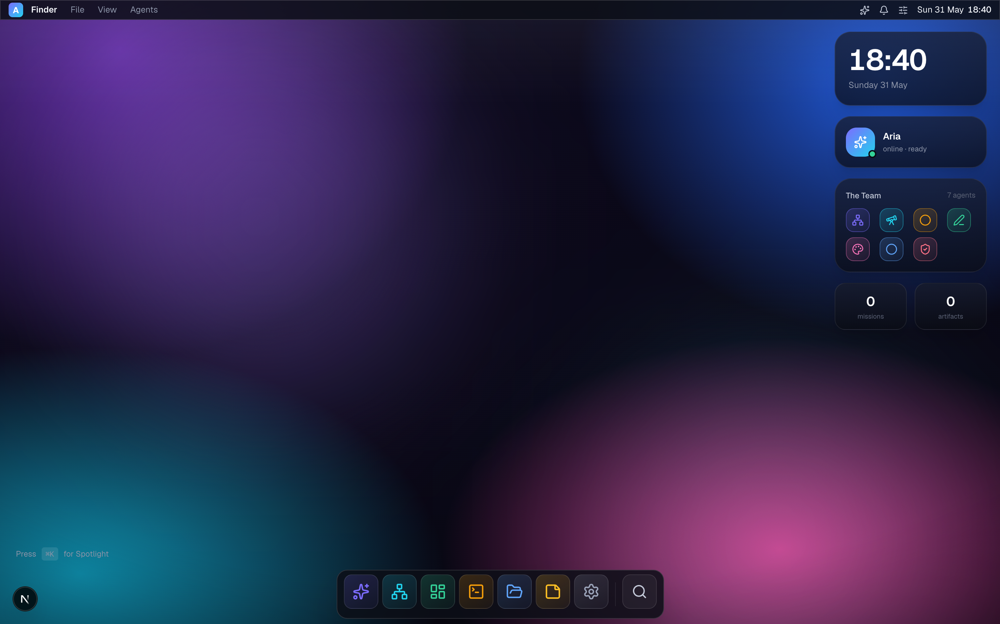
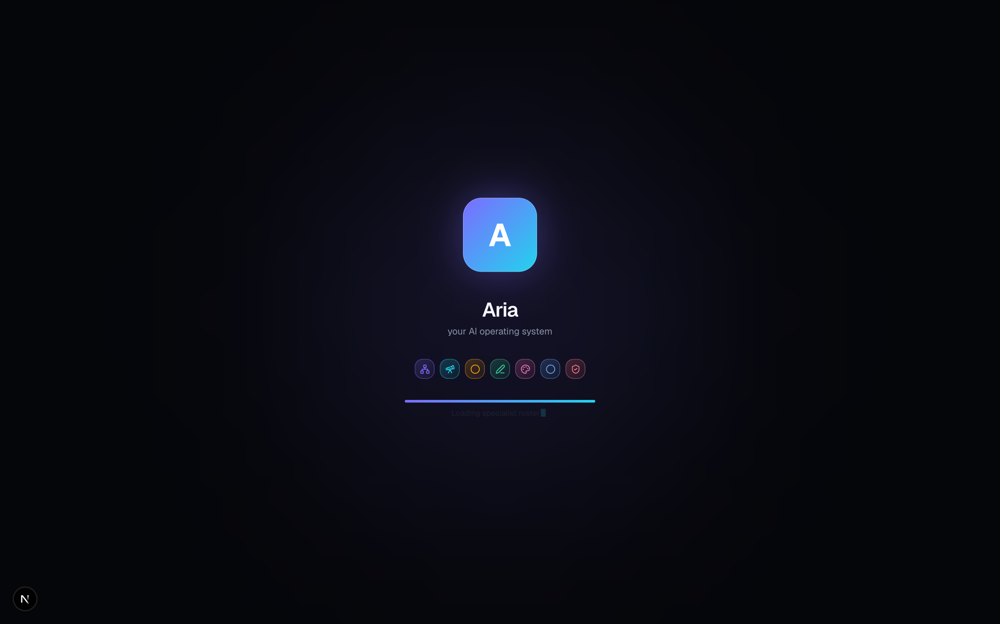
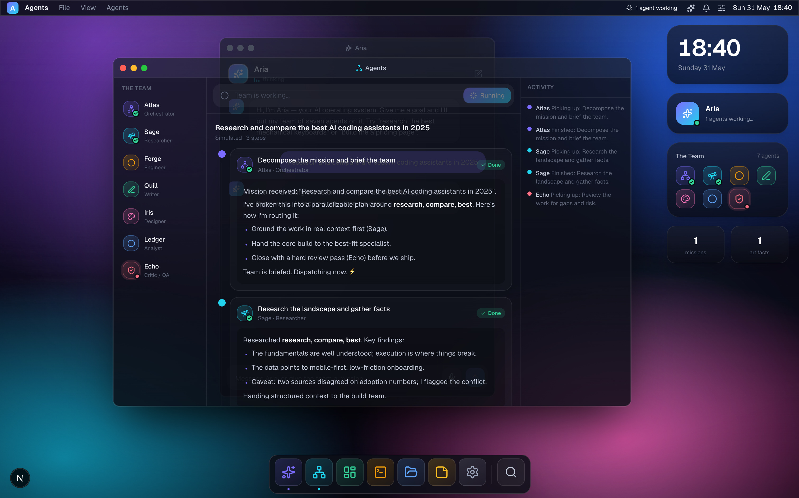
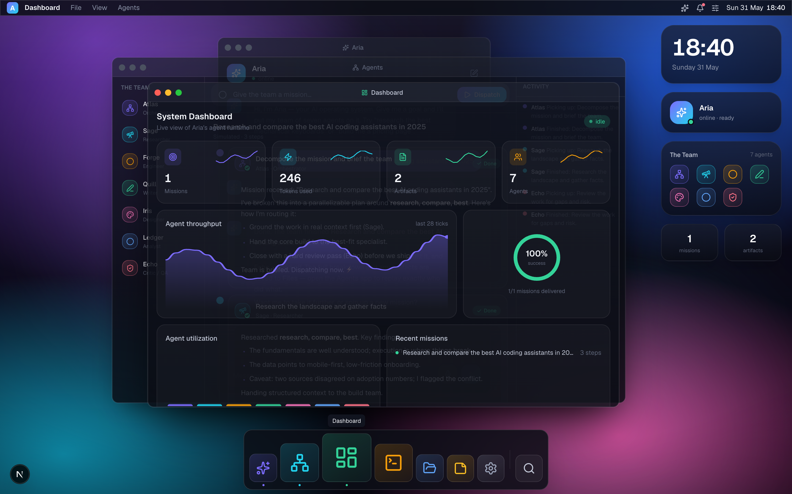
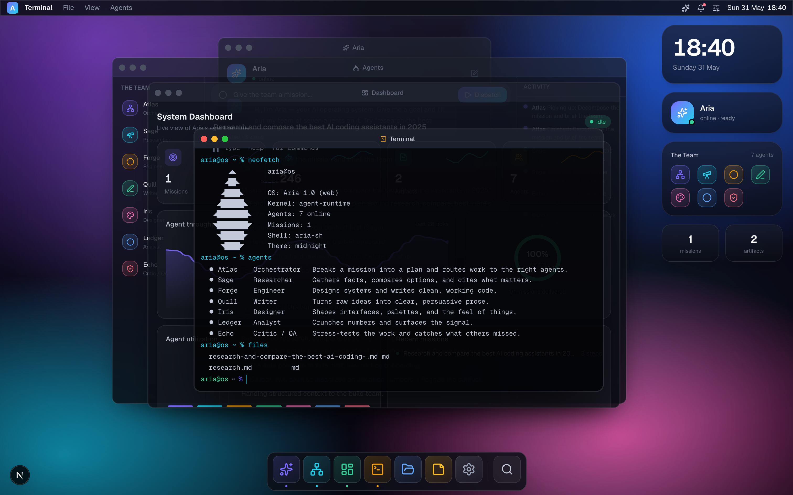
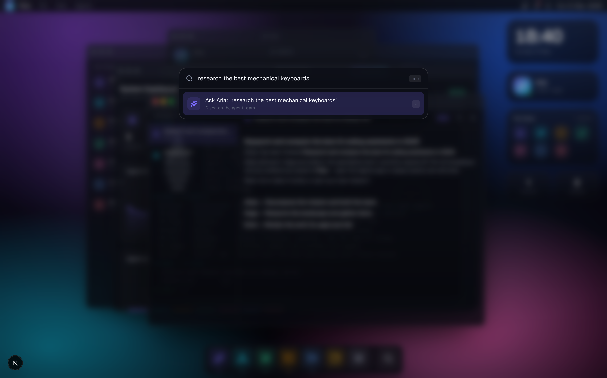
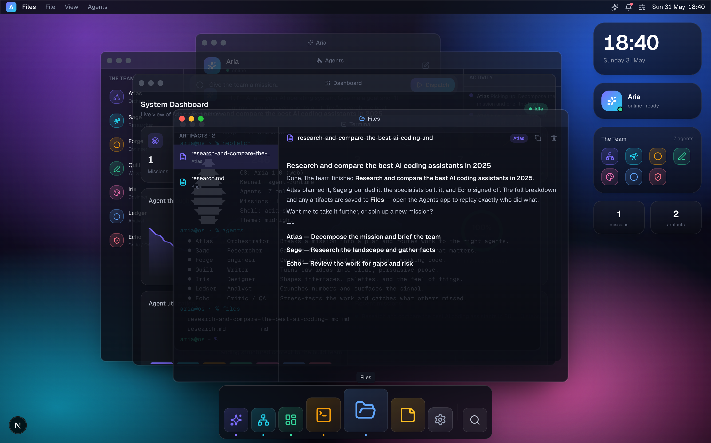
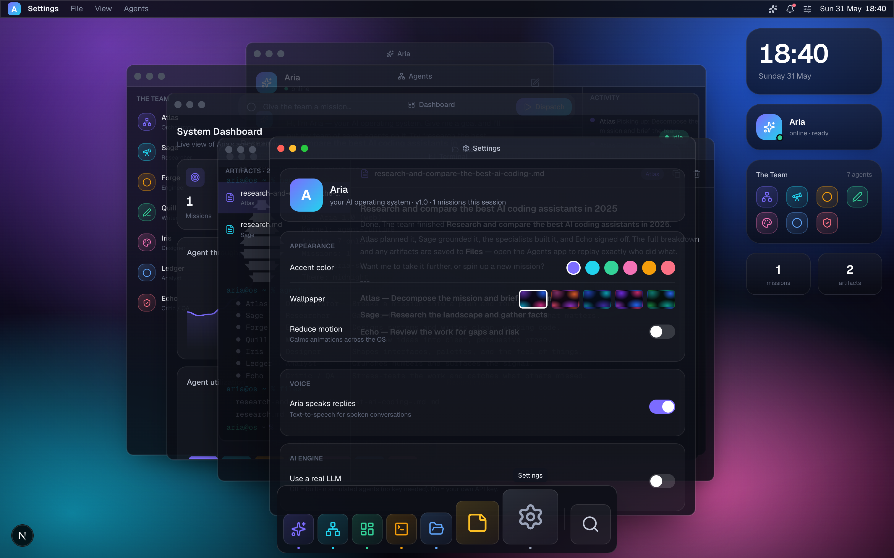

<div align="center">

# 🪐 Aria

### The AI operating system in your browser

Aria is an open-source, **macOS-style web desktop** with a built-in **multi-agent brain**.
Talk to it. Hand it a goal. Watch a team of seven specialist agents plan, build, and review it — live.

[](https://nextjs.org)
[](https://react.dev)
[](https://www.typescriptlang.org)
[](https://tailwindcss.com)
[](LICENSE)



</div>

---

## ✨ What is Aria?

Most "AI agent" demos are a chat box. Aria is a whole **operating system** — a windowed desktop you can
actually live in, with a real agent runtime underneath.

Give Aria a mission like *"research and compare the best AI coding assistants"* and she doesn't just reply —
she **dispatches a team**: Atlas decomposes the plan, the specialists do the work in parallel, Echo reviews
it, and every artifact is saved to your Files. You watch it all stream in real time across draggable windows.

And it works **the moment you clone it** — no API key required. A believable simulated engine drives the
agents offline. Want real answers? Paste your own OpenAI or Anthropic key in Settings and the exact same
UI lights up with a live LLM.

---

## 🎬 Highlights

| | |
|---|---|
| 🧠 **Live multi-agent missions** | A real orchestrator decomposes goals and routes work to 7 specialists, streaming their output, agent-to-agent chatter, and a flowing pipeline. |
| 🖥️ **A genuine desktop** | Animated boot → wallpaper → menu bar → magnifying dock → draggable, resizable windows with traffic lights, minimize & maximize. |
| 🔍 **Spotlight (⌘K)** | Fuzzy-search apps, run system commands, or *ask Aria anything* — dispatching a full mission from one keystroke. |
| 🗣️ **Aria speaks & listens** | Web-Speech voice: tap the mic to talk, and Aria talks back. Modality-aware and fully toggleable. |
| 📊 **Live dashboard** | Real-time throughput charts, agent utilization, success ring, token usage — all wired to your actual session. |
| 🖧 **Agent shell** | A real terminal (`run`, `ask`, `agents`, `cat`, `neofetch`…) that drives the same engine. |
| 🔌 **Bring your own key** | Simulated by default; flip one switch to run on OpenAI or Anthropic. Your key stays in your browser. |
| 🌑 **Crafted dark UI** | Glassmorphism, spring physics, custom SVG charts, five wallpapers, accent theming — zero heavyweight UI libs. |

---

## 👥 Meet the team

Aria is the face and voice of the OS. Under the hood she delegates to seven specialists:

| Agent | Role | What they do |
|---|---|---|
| 🜨 **Atlas** | Orchestrator | Breaks a mission into a plan and routes work to the right agents |
| 🔭 **Sage** | Researcher | Gathers facts, compares options, flags uncertainty |
| ⚙️ **Forge** | Engineer | Designs systems and writes clean, working code |
| ✒️ **Quill** | Writer | Turns raw ideas into clear, persuasive prose |
| 🎨 **Iris** | Designer | Shapes interfaces, palettes, and the feel of things |
| 📊 **Ledger** | Analyst | Crunches numbers and surfaces the signal |
| 🛡️ **Echo** | Critic / QA | Stress-tests the work and catches what others missed |

---

## 📸 Screenshots

### Boot sequence


### Agents — live mission control
Watch the plan stream in: Atlas briefs the team, specialists work in parallel, Echo reviews.


### Dashboard — your agent runtime, live


### Terminal — drive the agents from a shell


### Spotlight — search, command, or ask Aria


### Files & Settings
<p>


</p>

---

## 🚀 Quick start

```bash
git clone https://github.com/your-username/aria.git
cd aria
npm install
npm run dev
```

Open **http://localhost:3000** — Aria boots, the team comes online, and you can give it a mission
immediately. No configuration, no key.

> Voice features use the browser's Web Speech API and work best in Chrome / Edge.

### Build for production

```bash
npm run build
npm start
```

Deploys cleanly to **Vercel** (or any Node host) out of the box.

---

## 🔌 Bring your own LLM (optional)

By default Aria runs a self-contained **simulated** agent engine — great for demos and totally offline.
To use a real model:

1. Open **Settings → AI Engine**
2. Toggle **Use a real LLM**
3. Pick a provider (**OpenAI** or **Anthropic**) and paste your API key

That's it. The key is stored only in your browser's `localStorage` and is forwarded per-request straight
to the provider through a thin proxy route (`/api/chat`) — Aria's servers never persist it.

---

## 🏗️ How it works

```
src/
├── app/
│   ├── api/chat/route.ts     # BYO-key proxy → OpenAI / Anthropic
│   ├── layout.tsx · page.tsx · globals.css
├── lib/
│   ├── agents.ts             # the 7-agent roster + personas + system prompts
│   ├── simEngine.ts          # offline planner + believable per-agent output
│   ├── realEngine.ts         # client wrapper for the live LLM path
│   ├── voice.ts              # Web Speech STT + TTS
│   ├── apps.ts · types.ts · cn.ts
├── store/
│   ├── useOS.ts              # window manager, dock, notifications, settings
│   └── useAria.ts            # chat + the streaming mission runner + files
└── components/
    ├── os/                   # Boot, Desktop, MenuBar, Dock, Window,
    │                         # WindowManager, Spotlight, ControlCenter, …
    ├── apps/                 # Assistant, Agents, Dashboard, Terminal,
    │                         # Files, Notes, Settings + registry
    └── ui/                   # Icon, AgentAvatar, Charts, Markdown
```

**The mission runner** (`store/useAria.ts`) is the heart of it: it plans a mission into a dependency-aware
subtask graph, runs Atlas first, fans the specialists out in parallel, streams each agent's output
token-by-token into the UI, posts agent-to-agent messages to the activity bus, saves artifacts to Files,
and finishes with Aria's synthesis. The **same loop** powers both the simulated and the real-LLM paths —
only the text source changes.

---

## 🧰 Tech stack

- **Next.js 16** (App Router) · **React 19** · **TypeScript 5**
- **Tailwind CSS v4** (CSS-first config)
- **Zustand** for state (with `localStorage` persistence)
- **Framer Motion** for window physics & transitions
- **lucide-react** icons · hand-rolled **SVG charts** (no chart lib)
- **Web Speech API** for voice — no external service

---

## 🗺️ Roadmap

- [ ] Window snapping & tiling
- [ ] More apps (Browser, Music, a real code editor)
- [ ] Streaming responses from the LLM proxy (SSE)
- [ ] Pluggable custom agents & tools
- [ ] Persisted, replayable mission history
- [ ] Shareable mission permalinks

---

## 🤝 Contributing

PRs welcome! Adding an **app** is a two-step job: drop a component in `components/apps/`, register it in
`lib/apps.ts` + `components/apps/registry.tsx`. Adding an **agent** is one entry in `lib/agents.ts`.

---

## 📄 License

[MIT](LICENSE) — do anything you like, just keep the notice.

<div align="center">
<br/>
Built with care. If Aria made you smile, drop a ⭐.
</div>
